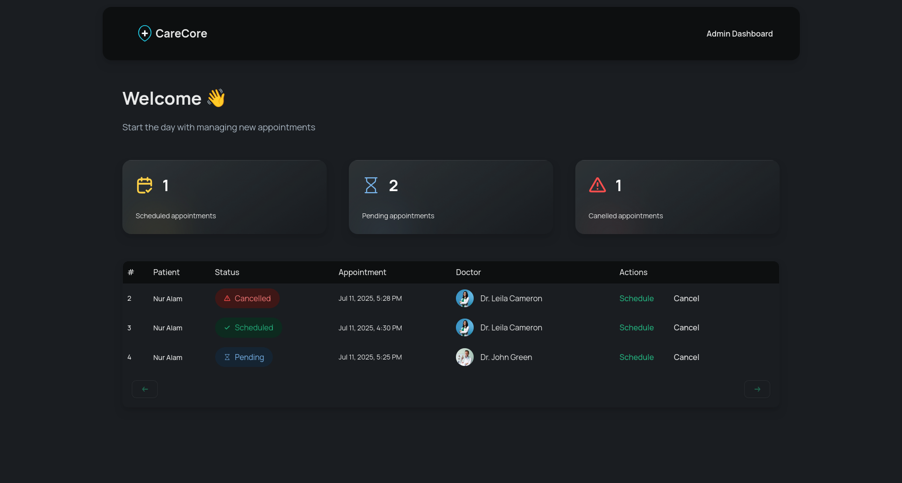

# CareCore

> **A modern healthcare management system**




**CareCore** is a modern, streamlined healthcare management system designed for clinics and hospitals to manage patient appointments efficiently and effortlessly.

🌐 [Try CareCore Live](https://carecore-mocha.vercel.app/)

---

## Features

### Patient Side

- Users must register with their name, email, and phone number.
- New users are required to submit all the necessary medical information.
- Patients can schedule new appointments.
- **SMS Notification System**: Get real-time updates about appointments via SMS.

### 🔐 Admin Dashboard

- Secure access with a passkey.
- Modern dashboard with quick insights.
- Detailed appointment table:
  - Patient details
  - Appointment time
  - Assigned doctor

## Tech Stack

- [Next.js](https://nextjs.org/)
- [Tailwind CSS ](https://tailwindcss.com/)
- [ShadCN UI](https://ui.shadcn.com/)
- [Appwrite](https://appwrite.io/)
- [Twilio](https://www.twilio.com/)

## Getting Started

> Clone the project and install dependencies.

```bash
git clone https://github.com/nuralam123/carecore.git
cd carecore
npm install
```

> Set up environment variables

Create a `.env.local` file with required keys

```
## Appwrite
APPWRITE_PROJECT_ID=
APPWRITE_API_KEY=

## Appwrite Database
DATABASE_ID=
PATIENT_COLLECTION_ID=
DOCTOR_COLLECTION_ID=
APPOINTMENT_COLLECTION_ID=

## Appwrite Storage
NEXT_PUBLIC_BUCKET_ID=

## Appwrite Endpoint
NEXT_PUBLIC_ENDPOINT=

## Admin Passkey
NEXT_PUBLIC_ADMIN_PASSKEY=
```

Also, go to the **Messaging** section in appwrite console, then `Providers > Create new provider > SMS`
Fill up the required details and click create.

> Run the app locally.

```bash
npm run dev
```

Visit `http://localhost:3000`

---

## License

This project is under [MIT LICENSE](./LICENSE)

---

## Acknowledgements

- This project was originally showcased at [JavaScript Mastery - YouTube](https://www.youtube.com/@javascriptmastery)
- Tutorial video: [Build and Deploy a Patient Management System with Next.js | Twilio, TypeScript, TailwindCSS - YouTube](https://youtu.be/lEflo_sc82g)
